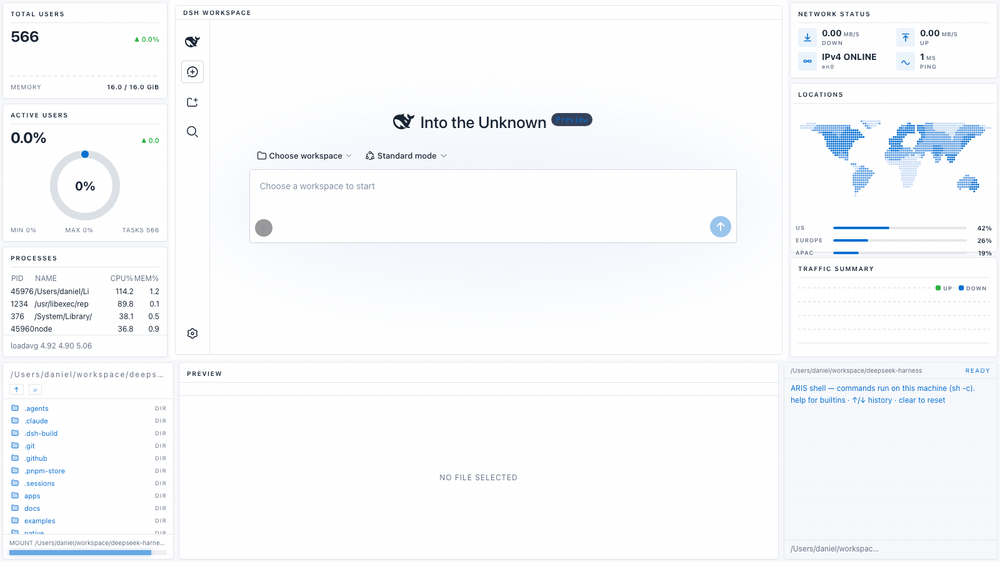
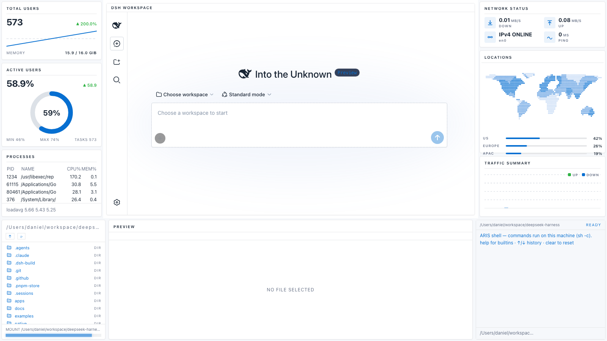

# @danielng23/dsh-edex-lightdeck-ui

**LIGHTDECK** — a *minimal light dashboard* eDEX-UI shell theme for the DeepSeek
Harness web GUI, driven by a reference analysis of the Tabler preview dashboard
(https://preview.tabler.io/index.html): white bordered cards floating on a
cool-gray canvas, a single measured blue accent `#066fd1`, hairline `#e6e7e9`
borders with 4px corners, and semantic green/red deltas — the first light
eDEX variant, trading the classic CRT glow for a clean enterprise look.





## Features

- **Light dashboard palette** — canvas `#f6f8fb`, card surfaces `#ffffff`,
  dark navy `#182433` text, muted slate `#667085` labels, accent blue
  `#066fd1`, success `#2fb344`, error `#d63939` — every value pixel-measured
  from the reference (see `analysis.json`)
- **Card language** — every widget is a closed white rectangle: 1px hairline
  border, 4px radius, barely-there elevation; small uppercase headers with a
  hairline divider (no glow, no brackets, no scanlines)
- **Widget reconciliation** — reference widgets matched to the shell slots:
  - **TOTAL USERS** (info slot) — big KPI + delta badge + blue sparkline over
    a dashed comparison line, fed by live CPU history, MEMORY caption
  - **ACTIVE USERS** (cpu slot) — KPI + semantic delta + radial donut gauge
    (blue arc on a `#dce1e7` track) driven by live CPU utilization
  - **NETWORK STATUS** — the reference's compact icon stat tiles: 2×2
    pale-blue icon squares (down/up throughput, link state, ping), live data
  - **TRAFFIC SUMMARY** (traffic slot) — alternating blue/green throughput
    bars over dashed gridlines, live rx/tx history
  - **LOCATIONS** — the reference's world-map choropleth replaces the
    `WORLD VIEW` globe: a dotted world map with blue activity intensity and
    region rows with mini progress bars
- **Workspace chrome** — the original DSH workspace is presented in the
  center as the theme's card: a hairline frame with a white `DSH WORKSPACE`
  title strip (hairline divider, dark uppercase label), the workspace inset
  below it, and the workspace's own background tokens overridden to the white
  card surface so it reads as part of the same dashboard
- **Light composer + sidebar** — white input card with gray-300 border and a
  soft blue focus ring; enterprise sidebar with pale-blue `#ebf3fb` active
  tints; `~/<workspace>` path prompt at the input's left edge
- **Bottom panel** — filesystem browser, file preview/editor, and a real host
  terminal, all in the light card chrome
- **Theme color setting** — Settings → General → Theme Color: Dashboard Blue
  (default), Signal Green, Alert Red, Navy, Slate

## Packages

| Package | Role |
|---|---|
| `@danielng23/dsh-edex-lightdeck-ui` | Installable bundle (`cordis.patch.yml`) |
| `@danielng23/dsh-lightdeck-client-ui-edex` | client — the LIGHTDECK shell frame + card widgets |
| `@danielng23/dsh-lightdeck-client-ui-theme-terminal` | client — the light theme token layer |
| `@danielng23/dsh-lightdeck-host-system-metrics` | host — system telemetry RPC endpoints |

## Install

```sh
pnpm dsh plugin --profile <profile> add @danielng23/dsh-edex-lightdeck-ui
```

Then restart the profile on your chosen port. The shell renders the LIGHTDECK
frame around the original UI (nothing is disabled — the workspace stays fully
interactive in its center card).

## Reference & method

Built by the reference-driven eDEX theme loop (`build.md` Steps 1–5):
vision-first analysis of the captured reference
(`analysis.md` / `analysis.json`, with pixel-measured palette and border
values), theme implementation through the shell's token + card layers,
widget reconciliation through the slot registries, and a review pass
(`review.md`: 0 console errors, computed-token checks, granularity zooms,
workspace-present check, static-animation inventory, pixel diff 5.27%).

## License

MIT
